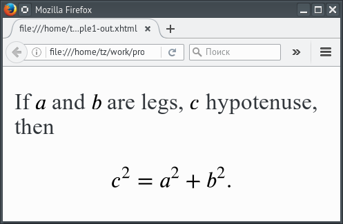

# ltxsvg

The command-line utility **ltxsvg** is intended to be used as preprocessor
converting TeX formulae embedded within XML file to SVG format. The program
uses an approach similar to one that implemented in **MetaPost** `btex … etex`
construct. The **ltxsvg** uses **TeX** and **dvisvgm** to render the formulae.

The program looks for any occurrence of `<math>` or `<display>` elements bound
to the custom namespace `"https://github.com/urbic/ltxsvg"` in the given XML
document and replaces it with the SVG rendering. The text content of these
elements is interpreted as TeX formula.

The preprocessed XHTML and SVG documents can be browsed in any SVG-capable
browser without use of tools such as [**MathJax**](http://mathjax.org).

[](http://opensource.org/licenses/Zlib)
[](http://travis-ci.org/urbic/ltxsvg)

## Features

- Support for inline and display formulae.

- Special handling of the formulae in XHTML documents which allows to align
  rendered formulae on the baseline and adjust its size to fit the size of the
  surrounding text.

- Special handling of the formulae in SVG documents which allows to place the
  rendered formulae to the specified position. It is also possible to attach
  the rendering at the specified point as well as does the `label` command in
  **MetaPost**.

- Optimization intended to reduce the size of the resulting file and to
  accelerate its rendering in a browser window.

- Caching the rendered formulae.

## Examples

### XHTML input 

```html
<?xml version="1.0" encoding="UTF-8"?>
<html
	xmlns="http://www.w3.org/1999/xhtml"
	xmlns:tex="https://github.com/urbic/ltxsvg"
	>
	<body>
		<p>
		If <tex:math>a</tex:math> and <tex:math>b</tex:math> are legs,
		<tex:math>c</tex:math> hypotenuse, then
		<tex:display>c^2=a^2+b^2.</tex:display>
		</p>
	</body>
</html>
```

…and the result:

.

### SVG input

```svg
<?xml version="1.0" encoding="UTF-8"?>
<svg
	xmlns="http://www.w3.org/2000/svg"
	xmlns:tex="https://github.com/urbic/ltxsvg" 
	version="1.1"
	viewBox="-20 -20 120 100"
	width="240"
	height="200"
	>
	<path d="M 0 0 v 60 h 80 z" fill="none" stroke="black" stroke-width="1"/>
	<tex:math x="0" y="0" placement="top">A</tex:math>
	<tex:math x="80" y="60" placement="bottomRight">B</tex:math>
	<tex:math x="0" y="60" placement="bottom">C</tex:math>
</svg>
```

…and the result:

.


### Generic XML input

```xml
<?xml version="1.0" encoding="UTF-8"?>
<display xmlns="https://github.com/urbic/ltxsvg">
\oint\limits_{\partial\sigma}\omega=\int\limits_\sigma d\omega
</display>
```

…and the result:

.

## Installation

To install **ltxsvg** type the following commands:

```bash
perl Makefile.PL
make
make test
make install
```

Pre-built binary packages for **openSUSE**, **Fedora**, **Debian** and
**Ubuntu** are available at [openSUSE Build
Service](https://software.opensuse.org/download.html?project=home%3Aconcyclic&package=ltxsvg).

## Requirements

**Perl**, **TeX**, **dvisvgm**.

## License

[zlib/png](LICENSE).

## Author

[Anton Shvetz](mailto:tz@sectorb.msk.ru?subject=ltxsvg)
